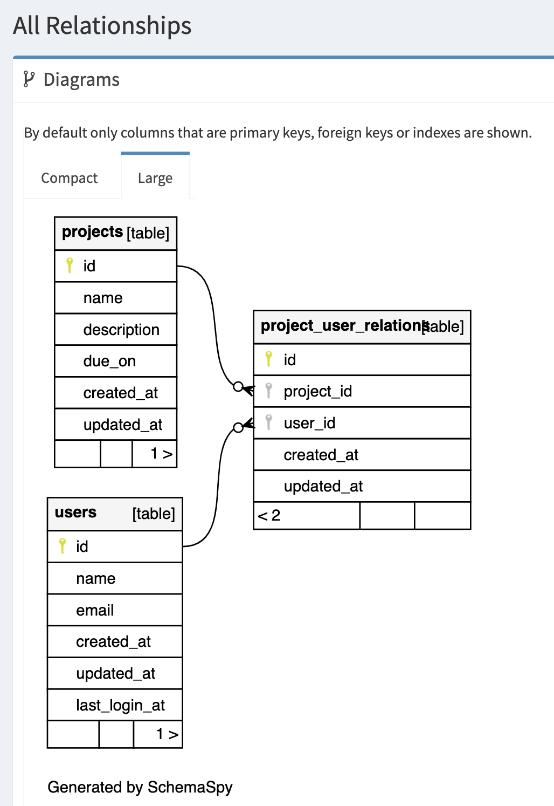

# README

ここでは rsila6 + rspec 環境で DB 内容を csv 出力するメソッドを作成する。  
そして、このメソッドの rspec をどの様に書いていくかを試して行きます。

## rails6 + rspec 環境の構築

rails6 + rspec 環境の作成については以下を参照すること。

- <https://blog.jnito.com/entry/2019/10/25/053521>  
  Everyday RailsのサンプルアプリをRails 6で動かす際に必要なテストコードの変更点

- <https://matthewhoelter.com/2019/09/12/setting-up-and-testing-rails-6.0-with-rspec-factorybot-and-devise.html>  
  Setup and test Rails 6.0 with RSpec, FactoryBot, and Devise

- <https://qiita.com/sk4/items/9547a8b082e741c88589>  
  新規Railsプロジェクト作成手順(Rails 6)

- <https://qiita.com/Ushinji/items/522ed01c9c14b680222c>  
  RailsアプリへのRspecとFactory_botの導入手順

完全な操作履歴ではないが、次のような手順でおこなうことができる。

ruby と rails のインストール。
```bash
$rbenv local 2.7.1
ruby 2.7.1p83 (2020-03-31 revision a0c7c23c9c) [x86_64-darwin19]

$gem install rails
$rails -v
Rails 6.0.3.2

$gem install bundler
$bundle -v
Bundler version 2.1.4
```

rspec の導入
```bash
$bundle install
$rails new rail6-with_rspec -B --skip-test
```

Gemfile 修正
```ruby
group :development, :test do
  # Call 'byebug' anywhere in the code to stop execution and get a debugger console                                                                   
  gem 'byebug', platforms: [:mri, :mingw, :x64_mingw]
  gem 'rspec-rails', '~> 4.0.0.beta2'
  gem 'factory_bot_rails'
  gem 'webdrivers'
  gem 'shoulda-matchers'
end
```

rails の起動
```bash
$bundle install
$rails g rspec:install
$bundle exec rails db:create
$bundle exec rails db:migrate
$bundle exec rails s
```
product モデルに to_csv_by_sql() と to_csv() メソッドを作った。  
to_csv_by_sql() は SQL 文で csv 出力してしまうものです。  
to_csv() は ActiveRecord::Relation を in_batch で回して CSV ファイルに書き込んでいくというものです。  

メモリ上の変数や ActoveRecord で取得した レコード内容は eq などで値をチェックして行くことができます。  
外部ファイル出力結果をどうやって rspec でテストするかをここで示します。  

### ファイル出力内容のテスト

projects テーブルの内容を ctiverEcord や CSV クラスをつかって次のように実装しているメソッドがあります。

```
  def self.to_csv
    headers = %w[id name description]
    File.open(csv_name, 'w:UTF-8') do |file|
      file.write BOM

      csv = CSV.new(file, headers: headers, write_headers: true)
      Project.order(:id).in_batches.each_record do |row|
        csv << [row.id, row.name, row.description]
      end
    end
  end
```

このメソッドが生成するファイル内容をチェックするテストを２つ書きました。  
1 つは、 File を一括読み込みしてその内容をチェックするものです。  
もう一つは、File への書き込処理を mock にして メモリー上にファイル内容を保持するようにして、そお内容をチェックするものです。  

ファイルを実際に読み混んで内容をチェックするには次のようにします。
```
expect(File.read(Project.csv_name)).to eq expect_lines
```

ファイルへ書き込まず、メモリー上へ書き込むようにするには次のようにします。
```
      before do
        allow(File).to receive(:open)
          .with(Project.csv_name, 'w:UTF-8')
          .and_yield(buffer)
      end
```
ファイル名 "Project.csv_name" への書き込みは、ファイルでなく
let(:buffer) { StringIO.new } へ書き込まえることになります。  

buffer へ書き込まれた内容のチェックは,次のように行います。
```
      it 'contents of csv file' do
        subject
        expect(buffer.string).to eq expect_lines
      end
```
この方法では、時間がかかるファイル IO を回避できるし、生成されたファイルの後始末も不要になります。  


参考情報
- <https://github.com/samg/diffy>  
   Diffy - Easy Diffing With Ruby

- <https://www.altova.com/blog/how-to-compare-csv-files/>
  HOW TO COMPARE CSV FILES OR COMPARE A CSV FILE TO A DATABASE TABLE

## 時間の操作

to_csv() メソッドで生成する csv ファイル名には、実機日時が埋め込まれるようになっています。  
テスト実機の度に日時は変化します。そのようなものをテストするんは大変です。  
実行日時を任意の日時に設定したら、時間を止めてしまう応報があります。  
これを利用すると、出力ファイル名を一定にすることができます。

参考情報
- <https://www.ryotaku.com/entry/2019/08/27/000000>  
  現在日時をズラしたテストが実行できる「TimeHelpers（travel・travel_back・travel_to）」

- <https://himakuro.com/modify-timezone-to-jst-in-rails#i-4>  
  Railsのtime_zoneを変更する

## DB の id をリセットする

csv ファイルには、 record id が含まれています。  
通常は, レコードの id はテスト実機の度に変化してしまいます。  
テーブルの Primary Key をリセットすることができれば、テスト処理中に生成されるレコードの id を一定にすることができます。

==> DB を sqlite3 -> MySQL に変更した。 
すると, MySQL の場合 primary_key リセットがうまくできなかった。
primary_key リセットはあきらめて、テスト時の expected の値の id を DB 情報から取得する様に変更した。

参考情報
- <https://medium.com/@tiffanytang_30644/how-to-reset-your-activerecord-postgresql-and-sqlite-id-sequences-with-a-simple-ruby-gem-15b90c6fbdac>  
  How to Reset Your ActiveRecord PostgreSQL and SQLite ID Sequences with a Simple Ruby Gem

### Mysql について

参考情報
- <https://weblabo.oscasierra.net/mysql-select-into-outfile/>  
  MySQLのSELECT結果をCSVファイルで出力する方法

標準設定のままだと, SQL で CSV 出力させようとすると  
"he MySQL server is running with the –secure-file-priv option so it cannot execute this statement"  
のエラーになる。  
my.ini の編集が必要になる。  

### 

- <https://www.techscore.com/blog/2017/12/04/fast_and_low-load_processing_method_when_exporting_csv_from_db_with_rails/>  
  RailsでDBからCSVエクスポートする時に高速かつ低負荷な処理方法とは？

- <https://tech.recruit-mp.co.jp/server-side/post-19614/>  
  Railsアプリの処理を100倍以上に高速化して得られた知見


### CSV 出力のパフォーマンス

大容量データを SQL 出力する際の実装によるパフォーマンス比較をしていく。
ますは、大量データを作成する rkae task に作成をする。  
そして、そのデータを使って csv 出力の速度・メモリー量などを計測するテストを作る。  
(実際の DB では複数のテーブルが関連して N+1 問題が発声したりする。  
こっこでは、まずは 1 テーブルの出力において、実装の差がパフォーマンスに与える影響を示していく)

- 100万件データ作成をする rake task 

insert_all! をつかって 10000  レコードずつ SQL 発行している （百万件なら 100 回の SQL)

```bash
$time rake "make_big_db:projects[1000000]"
#-- created 1000000 recoreds.

real	1m5.553s
user	0m54.452s
sys	0m1.402s
```

```bash
$rails c
Loading development environment (Rails 6.0.3.2)
[1] pry(main)> Project.count
   (0.4ms)  SET NAMES utf8mb4,  @@SESSION.sql_mode = CONCAT(CONCAT(@@sql_mode, ',STRICT_ALL_TABLES'), ',NO_AUTO_VALUE_ON_ZERO'),  @@SESSION.sql_auto_is_null = 0, @@SESSION.wait_timeout = 2147483
   (22.0ms)  SELECT COUNT(*) FROM `projects`
=> 1000000
[2] pry(main)> Project.first
  Project Load (0.3ms)  SELECT `projects`.* FROM `projects` ORDER BY `projects`.`id` ASC LIMIT 1
=> #<Project:0x00007fd11877d5f8
 id: 1,
 name: "Project 1",
 description: "Test project 1",
 due_on: nil,
 created_at: Tue, 07 Jul 2020 17:36:20 JST +09:00,
 updated_at: Tue, 07 Jul 2020 17:36:20 JST +09:00>
```


参考情報
- <https://qiita.com/taiteam/items/1b1be0578d1dc6e00a17>  
  Rails6.0におけるbulk insert

### csv 出力処理のベンチマーク

つぎのような rake task を作成した。

```bash
$rails -T bench
rails benchmark:export_csv[offset,limit]  # benchmark for csv export, (offset, limit はオプション指定)
```

現在の DB の porjects テーブルに対して。 Project.to_csv, Project.to_csv_by_sql を実行して
その時間を計測するものである。  
1000 万件データを作った上で、出力件数を 1万、10万、100 万, 1000万 で実行してみた。

```bash
$ time rails make_big_db:projects[10000000]
real	11m45.992s
user	8m43.408s
sys	0m4.345s


$rails "benchmark:export_csv[,10000]"
                   user     system      total        real
to_csv_by_sql  0.064206   0.024884   0.089090 (  0.109074)
to_csv         0.200538   0.011255   0.211793 (  0.220144)
to_csv_x2      0.227532   0.011135   0.238667 (  0.243704)

$rails "benchmark:export_csv[,100000]"
                   user     system      total        real
to_csv_by_sql  0.073267   0.034719   0.107986 (  0.295334)
to_csv         1.910500   0.055642   1.966142 (  2.047811)
to_csv_x2      1.985303   0.087526   2.072829 (  2.113386)

$rails "benchmark:export_csv[,1000000]"
                   user     system      total        real
to_csv_by_sql  0.072509   0.034445   0.106954 (  2.279844)
to_csv        18.967090   0.464478  19.431568 ( 20.277893)
to_csv_x2     20.790269   0.882708  21.672977 ( 22.145056)

$rails "benchmark:export_csv[,10000000]"
                   user     system      total        real
to_csv_by_sql  0.060586   0.022766   0.083352 ( 27.927678)
to_csv       252.407870   4.769842 257.177712 (265.961546)
to_csv_x2    621.193280 398.443297 1019.636577 (1276.224578)
```

上の出力の real 列をみて比較をする。  
いずれの方法でも出力件数に比例して、実行時間も増加する。  
to_csv_by_sql (SQLを使う) は ActiveRecord をつかった方法の 1/10 であり、圧倒的に速い。  

念のために出力 csv の行数を確認してみる。

```bash
$wc -l csvs/*.csv
   10001 csvs/projects_2020-07-08_12_01_58_290JST.csv
   10001 csvs/projects_2020-07-08_12_01_58_597JST.csv
  100001 csvs/projects_2020-07-08_12_02_07_713JST.csv
  100001 csvs/projects_2020-07-08_12_02_09_998JST.csv
 1000001 csvs/projects_2020-07-08_12_02_19_467JST.csv
 1000001 csvs/projects_2020-07-08_12_02_42_720JST.csv
 10000001 csvs/projects_2020-07-08_12_02_56_531JST.csv
 10000001 csvs/projects_2020-07-08_12_06_50_059JST.csv
```

ヘッダ業 + データ行がそれなりに出力されているのが確認できる。  
(もちろんこの時点で rspec テストは PASS している)


### ActiveRecord での方法の改善

ActiveRecord での方法は SQL での方法よりは遅いとはいえ、もうすこく速くできないか？

まずは 無駄な 列情報を取得しないようにすることで、どれくらい差がでるかを計測してみる。
その前に、便chまrkの rake task にメモリー使用量の計測も組み込んだ。

to_csv は、 csv に出力する列だけを select(:id, :name, :description) として取得するようにした版、  
to_csv_x は select() 無しの版である。

```bash
$ rails "benchmark:export_csv[,100000]"
                   user     system      total        real
to_csv_by_sql  0.063541   0.024184   0.087725 (  0.264029)
to_csv         1.925162   0.055407   1.980569 (  2.058543)
to_csv_x2      1.979045   0.086058   2.065103 (  2.102300)
Calculating -------------------------------------
       to_csv_by_sql    79.386k memsize (   928.000  retained)
                       605.000  objects (     1.000  retained)
                        50.000  strings (     0.000  retained)
              to_csv   228.219M memsize (     1.074k retained)
                         3.858M objects (     2.000  retained)
                        50.000  strings (     1.000  retained)
           to_csv_x2   207.242M memsize (     1.074k retained)
                         3.601M objects (     2.000  retained)
                        50.000  strings (     1.000  retained)
```

select() を行うことで 5 % の速度アップ、10 % のメモリー使用量削減硬の効果があった。  

参考情報
- <https://blog.saeloun.com/2020/04/29/rails-support-descending-order-for-find-each-find-in-batches.html#with-rails-61>
  Rails 6.1 now supports order option for find_each, find_in_batches and in_batches methods.


現時点の DB は単純なレコードの１つのテーブルである。
この後は 複数のテーブルを 多対多なのの関連をもたせ、N+1問題を避けた csv 出力鳳凰を作っていく。

### has_meny な関係の csv 出力

user <--> project が 多対多 の関係を定義した。

そして、user の csv 出力では、  
　　user の id, user の名前、 所属している oprojet の名前
を出力するようにする。  
ある user が複数の project に 2 つ属していれば、２行出力される。  

２ つの csv 出力を作った。  

to_csv_x はいわゆる N+１ 問題が発生する方法である。  
もう一つはそれを回避した方法である。

```bash
sdb:make_big_db[1000000,1000000]
```
として、 user を 100万, project を 100 万件 つくり, 所属 project が　0 , 1, 3, 5 になる user が存在するように「設定した。

user csv 出力のベンチマーク結果を示す。

```bash
$rails "benchmark:csv:user[,10000]"
                   user     system      total        real
to_csv_by_sql  0.156062   0.033529   0.189591 (  0.257232)
to_csv         0.419291   0.016384   0.435675 (  0.487039)
to_csv_x       8.639824   0.383725   9.023549 ( 10.847047)

 rails "benchmark:csv:user[,100000]"
                   user     system      total        real
to_csv_by_sql  1.042981   0.095814   1.138795 (  2.175442)
to_csv         4.490967   0.150985   4.641952 (  5.174015)
to_csv_x      87.822764   4.218651  92.041415 (111.239626)

$rails "benchmark:csv:user[,1000000]"
                   user     system      total        real
to_csv_by_sql 11.334386   0.646910  11.981296 ( 21.293580)
to_csv        47.643874   1.258733  48.902607 ( 56.264028)
to_csv_x     833.608000  37.986650 871.594650 (1054.837051)
Calculating -------------------------------------

$ rails "benchmark:csv:user[,2000000]"
                   user     system      total        real
to_csv_by_sql 11.319850   0.597424  11.917274 ( 21.650677)
to_csv        47.052654   1.210170  48.262824 ( 56.515092)
to_csv_x     862.790913  38.584010 901.374923 (1093.834346)
```

to_csv と to_csv_x では圧倒的な差がある。 

log/development.rb を削除してから, rails "benchmark:csv:user[,100]" を実行してから log を less -R で見てみる。  
sql を使った方法(to_csv_by_sql) では本質的には SQL は 1 回、  
N+1 問題を回避した方法 (to_csv) では、1 回、 
 N+1 問題が発生する方法 (to_csv_x) では、user 1 個毎に SQL が発行される。  
(N＋1 問題を回避した方法では、SQL 発行発行数は user 1000 個毎に 1回の発行となる)  
SQL の発行回数が、実行速度の差に現れる。
また ActiveRecord を使うと、オブジェクト生成処理の時間がかかる分 遅くくなる。  

参考情報
- <https://qiita.com/k-yamada-github/items/e8dbd6f53c638a930588>  
    Railsでmysqlをdump、reset、restoreするRakeタスク

- <https://www.blograils.com/posts/rails-backup>  
  RailsのDBバックアップ（gem:yaml_db）

### csv の import

参考情報
- <https://qiita.com/taiteam/items/1b1be0578d1dc6e00a17>  
  Rails6.0におけるbulk insert

- <https://qiita.com/ham0215/items/d307a242995d440d854f>  
  Rails6で追加されたinsert_allとimport(とその他)のパフォーマンス検証

- <https://www.dbonline.jp/mysql/function/index48.html>  
  CONVERT_TZ関数 (指定した日時のタイムゾーンを変更した値を取得する)

- <https://github.com/sogilis/csv_fast_importer>
  CSV Fast Importer

- <https://blog.saeloun.com/2019/11/26/rails-6-insert-all.html>
  Rails 6 bulk insert records


### ER 図を chemaspy で作る

```bash
$cd schemaspy
$run.sh
```
で ER 図作成をできるようにした。



参考情報
- <https://qiita.com/omokawa_yasu/items/f0571094d5856bbe314e>
  SchemaSpyを使って、RedmineのER図作成を自動化する

- <https://qiita.com/miua/items/14ec9d03a2d6e56af4e4>
  転職してデータ構造を把握するためにやったこととツール

- <https://qiita.com/maika_kamada/items/c23c2a3717168c3b8e7a>
  【SchemaSpy】手間をかけずにRDS(MySQL)からER図を生成したい

  ### import 処理のベンチマーク

  